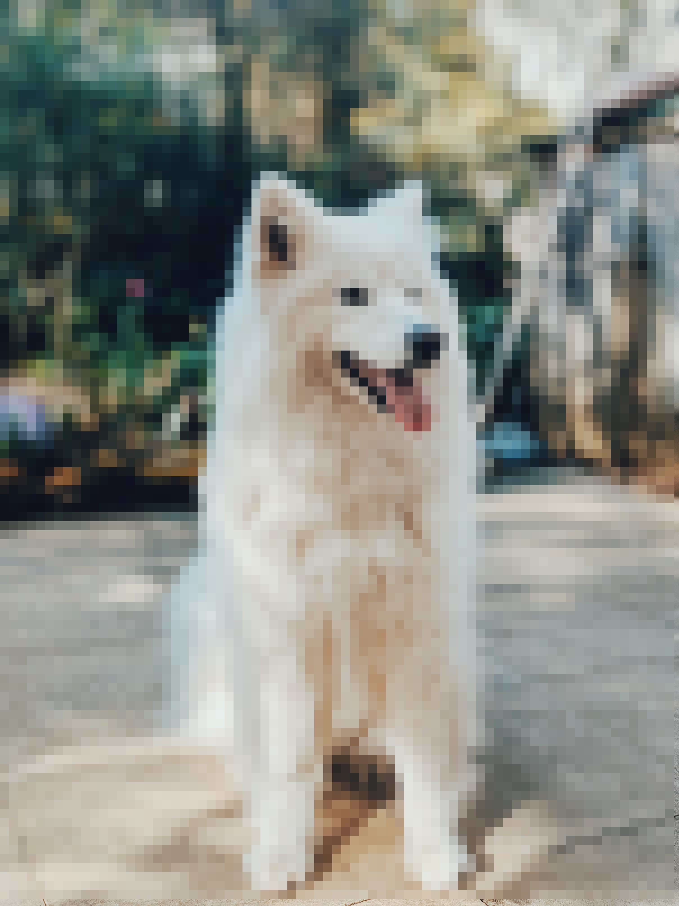

# Pixelisation

## What is it ?

Pixelisation is a free python program that will divide your image into larger pixels.

Before | After
------ | -----
 | 

# How to use it ?

# Requirements

- Python 3
- Python module :
	- [numpy](www.pypi.org/project/numpy)
	- [openCV](www.pypi.org/project/opencv-python)
